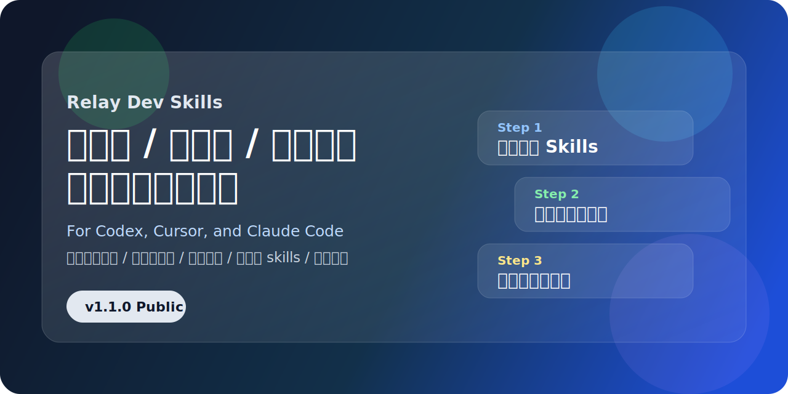
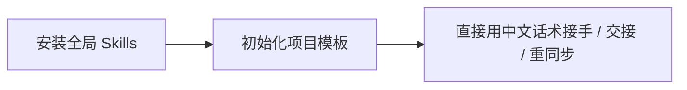

# 接力开发：跨模型 / 跨账号 / 跨工具协作母包




一套面向 Codex、Cursor、Claude Code 的接力开发 skills 与项目模板，支持中文自然语言触发、多会话上下文恢复和标准交接。

- 仓库地址：[relay-dev-skills](https://github.com/liutao773680119-cmyk/relay-dev-skills)
- 英文简介：[README_EN.md](README_EN.md)
- 使用演示：[USAGE_DEMO.md](USAGE_DEMO.md)
- 贡献说明：[CONTRIBUTING.md](CONTRIBUTING.md)

## 3 步开始



最短上手路径：

1. 安装全局 skills
2. 给你的项目铺接力开发模板
3. 在新会话里直接说：`接手这个项目，按接力开发规则来`

## 为什么需要它

当你在同一个项目里频繁切换这些场景时，问题会反复出现：

- 从一个模型切到另一个模型，上一轮做到哪一步很容易丢。
- 从一个账号切到另一个账号，历史上下文和约定不再天然连续。
- 从 Codex 切到 Cursor、再切到 Claude Code，同一件事会被重复分析、重复提问、重复改。
- 会话一长，模型容易“只记得最近几轮”，忘掉真正重要的任务状态、风险和下一步。
- 团队里不同人、不同模型、不同工具接手同一个项目时，很难保持统一执行标准。

结果通常是：

- 每次接手都要重新解释背景
- 每次收尾都写不清楚交接
- 同一项目里出现多个互相冲突的“当前版本”
- 明明不是业务问题，却大量消耗在上下文恢复上

## 这个仓库解决什么问题

这个仓库不是业务框架，而是一套“接力开发协议”。

它做的事情很明确：

1. 给模型一个统一的接手入口  
让新会话先恢复上下文，再继续执行，而不是一上来凭记忆乱推断。

2. 给项目一套统一的交接文件  
用 `progress.md`、`task_plan.md`、`findings.md`、`task_registry.md`、`修改记录_会话备忘.md` 把“现在做到哪了”落到文件里。

3. 给不同工具一套统一规则  
让 Codex、Cursor、Claude Code 接手时遵守同一套节奏和格式。

4. 给用户一套自然语言触发方式  
你不需要记 skill 名，直接说中文即可。

## 它包含什么

这个仓库主要包含两部分：

1. 全局 skills  
位置在 `skills/`，适合安装到：
- `~/.codex/skills`
- `~/.claude/skills`
- `~/.agents/skills`

2. 新项目模板  
位置在 `starter/relay-kit-v1/`，适合给一个业务项目快速铺接力开发骨架。

核心 skills 包括：

- `relay-dev`
- `relay-start`
- `relay-resync`
- `relay-handoff-stop`
- `relay-scope-change`
- `relay-verify`

## 一键安装

### Windows

```powershell
powershell -ExecutionPolicy Bypass -File .\scripts\install.ps1 -Targets codex,claude,agents -Source skills -Force
```

### macOS / Linux

```bash
bash ./scripts/install.sh --force
```

默认会安装到：

- Codex：`~/.codex/skills`
- Claude Code：`~/.claude/skills`
- Cursor / 共享 agents：`~/.agents/skills`

## 安装后怎么说

安装完成后，在新会话里直接说中文即可：

- `接手这个项目，按接力开发规则来`
- `给这个项目初始化接力开发`
- `重新同步当前任务`
- `做一次标准交接`
- `按接力开发流程处理这个项目`

其中最常用的是这 3 句：

- `接手这个项目，按接力开发规则来`
- `重新同步当前任务`
- `做一次标准交接`

## 最短使用路径

### 场景 1：你要开始一个新项目

1. 先安装全局 skills
2. 在目标项目里执行初始化
3. 再对模型说：`给这个项目初始化接力开发`

初始化命令示例：

```powershell
powershell -ExecutionPolicy Bypass -File ".\scripts\relay_init.ps1" `
  -ProjectRoot "D:\Projects\my_new_project" `
  -Profile stock-cn `
  -Tools antigravity,cursor,vscode,codex `
  -Naming bilingual `
  -Force
```

### 场景 2：你在同一个项目里换模型

旧会话收尾时说：

- `做一次标准交接`

新会话开场时说：

- `接手这个项目，按接力开发规则来`

### 场景 3：你换了账号或换了工具

只要项目里的交接文件还在，你依然可以在新会话里说：

- `接手这个项目，按接力开发规则来`

这套技能的重点就是把“上下文连续性”从账号记忆，转成项目文件记忆。

## 这套方案的核心原则

### 1. 摘要优先、按需深读

新会话不是机械全文通读所有长文件，而是优先读：

- `AGENTS.md`
- `task_registry.md`
- `progress.md` 顶部快照
- `task_plan.md` 当前任务段
- `findings.md` 当前任务段
- `修改记录_会话备忘.md` 最近相关记录

只有当上下文冲突、恢复失败、或用户明确要求全文核对时，才扩大读取范围。

### 2. 单会话锁定单 Task-ID

一个会话只处理一个 `Task-ID`，避免多个任务交叉污染。

### 3. 结束前必须交接

如果没有把快照和会话记录写回文件，下一个模型再强也只能猜。

## 仓库结构

```text
skills/                    # 面向外部分发的公开 skills
.relay/skills/             # 母包内部维护用 skills
starter/relay-kit-v1/      # 新项目初始化模板
scripts/install_skills.py  # 跨平台核心安装脚本
scripts/install.ps1        # Windows 安装入口
scripts/install.sh         # macOS / Linux 安装入口
scripts/relay_init.ps1     # 项目模板初始化入口
```

## 推荐仓库名与描述

推荐仓库名：

- `relay-dev-skills`
- `multi-session-relay`
- `ai-relay-workflow`

推荐 GitHub 仓库描述：

`一套面向 Codex、Cursor、Claude Code 的接力开发 skills 与项目模板，支持中文自然语言触发、多会话上下文恢复和标准交接。`

推荐 GitHub Topics：

- `codex`
- `claude-code`
- `cursor`
- `ai-workflow`
- `developer-tools`
- `prompt-engineering`
- `agent-skills`
- `context-handoff`
- `multi-session`

## 首次发布信息

- 当前版本：`v1.1.0`
- Release 文案：[RELEASE_NOTES_v1.1.0.md](RELEASE_NOTES_v1.1.0.md)

## 开源说明

- License：`MIT`
- 当前已验证：
  - Windows 安装脚本可用
  - GitHub 仓库和 `v1.1.0` release 已发布
- 待补验证：
  - `install.sh` 在干净 macOS / Linux 环境的实测

## 适合谁

这套仓库特别适合这些场景：

- 你经常在多个 AI 工具之间切换
- 你会更换模型、账号、设备继续同一个项目
- 你希望把“项目记忆”落到文件里，而不是赌模型上下文刚好还在
- 你想让不同模型接手时执行标准尽量统一

如果你只在一个会话里做一次性小任务，它可能显得偏重。  
如果你长期、多轮、跨工具做同一个项目，它会非常有价值。
