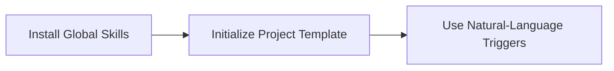

# Relay Dev Skills

Relay development skills and project templates for Codex, Cursor, and Claude Code.

This repository is designed for one specific problem: keeping the same project coherent when you switch models, switch tools, switch accounts, or continue work in multiple sessions.

## The Problem

When people develop the same project across different AI tools, the failure mode is predictable:

- the next session does not know what the previous session completed
- the same project gets picked up with different rules and different assumptions
- important status lives in chat history instead of project files
- handoff quality depends on memory instead of structure

This repo turns that into a repeatable workflow.

## 3-Step Start



Minimal path:

1. Install the global skills
2. Initialize a project with the relay template
3. Start a new session and trigger the workflow

## What This Repo Provides

1. Global relay skills  
Installed into `~/.codex/skills`, `~/.claude/skills`, or `~/.agents/skills`.

2. Project bootstrap templates  
Used to initialize a new project with handoff files, rules, and prompt scaffolding.

3. Natural-language triggers  
Users can speak in plain Chinese instead of remembering skill names.

## Included Skills

- `relay-dev`
- `relay-start`
- `relay-resync`
- `relay-handoff-stop`
- `relay-scope-change`
- `relay-verify`

## Quick Install

### Windows

```powershell
powershell -ExecutionPolicy Bypass -File .\scripts\install.ps1 -Targets codex,claude,agents -Source skills -Force
```

### macOS / Linux

```bash
bash ./scripts/install.sh --force
```

## Typical Triggers

- `接手这个项目，按接力开发规则来`
- `重新同步当前任务`
- `做一次标准交接`

## Core Principle

This system does not rely on chat memory alone.  
It moves project memory into files:

- `progress.md`
- `task_plan.md`
- `findings.md`
- `task_registry.md`
- `修改记录_会话备忘.md`

The result is a more stable handoff workflow across tools and sessions.

## Repository Layout

```text
skills/                    public skill distribution directory
.relay/skills/             internal maintenance source
starter/relay-kit-v1/      project bootstrap templates
scripts/install_skills.py  cross-platform installer core
scripts/install.ps1        Windows installer
scripts/install.sh         macOS / Linux installer
scripts/relay_init.ps1     project initialization entry
```

## Version

- Current public version: `v1.1.0`
- License: `MIT`
